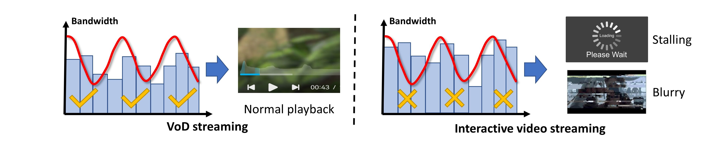
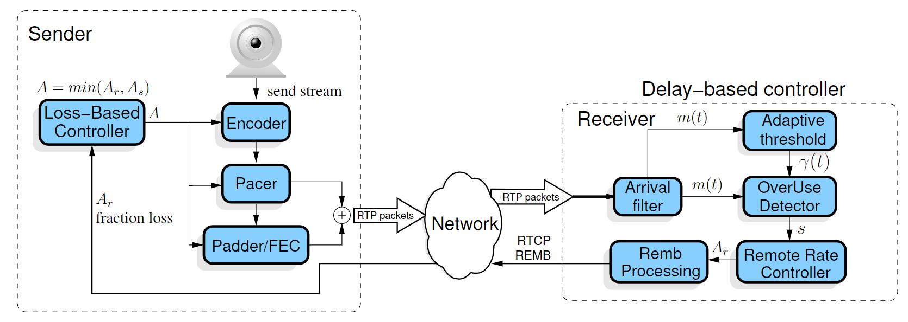
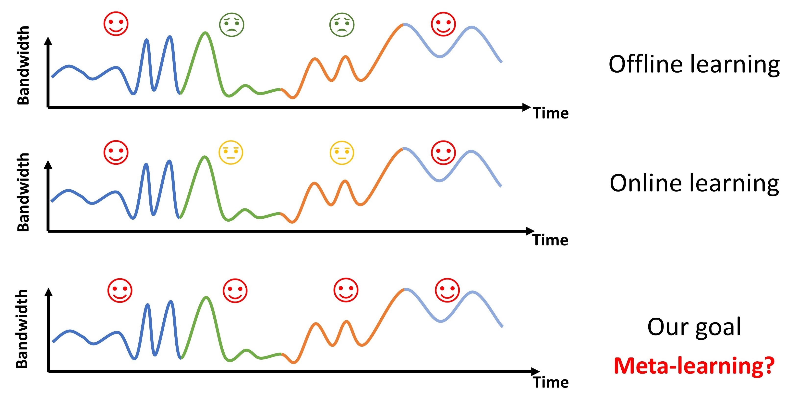
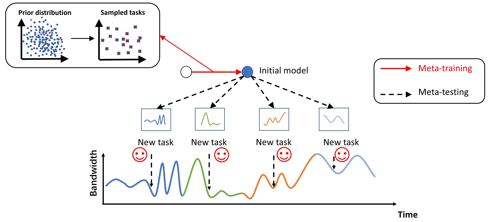
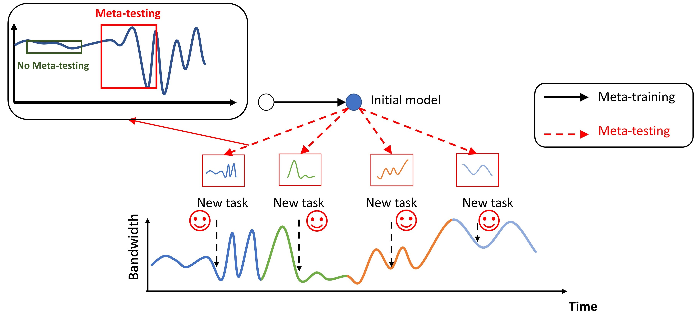
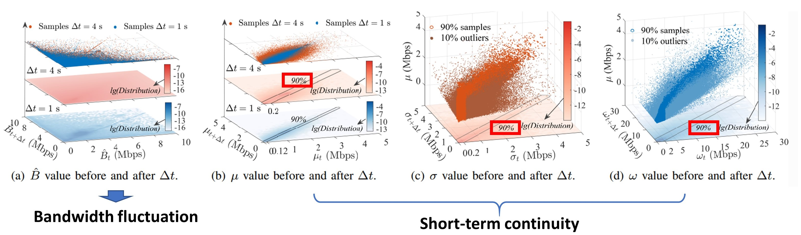
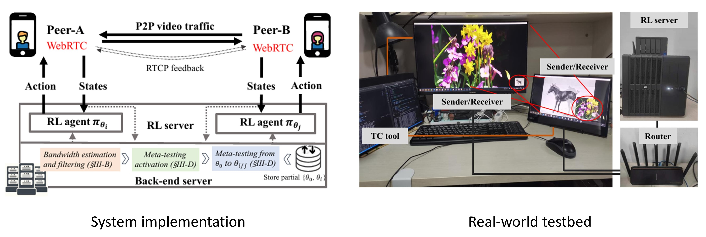
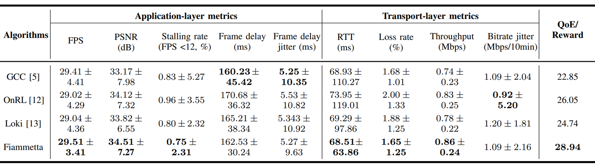
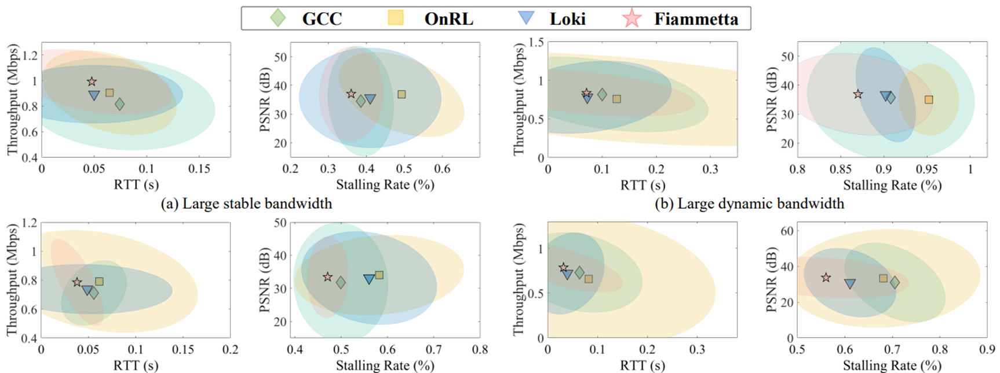

# *Fiammetta*: Meta-RL Powered Congestion Control

## Table of Contents

[TOC]

## 1. Introduction

Maximizing **quality of experience (QoE)** for **interactive video streaming** has been a long-standing challenge, as its delay-sensitive nature makes it more vulnerable to **bandwidth fluctuations**. While **reinforcement learning (RL)** has demonstrated great potential, existing works are either limited by fixed models or require enormous data/time for online adaptation, which struggle to fit time-varying and diverse network states. 

In this essay, I will introduce our project ***Fiammetta***, a **meta-reinforcement-learning (Meta-RL) based congestion control algorithm** that aims to tackle the above challenge. To begin with, we performed a large-scale measurement on the interactive video service of ***Tencent WeCom*** to study real-world network fluctuations. Surprisingly, our analysis shows that, compared to time-varying network metrics, **network statistics exhibit noticeable short-term continuity**, which offers opportunities for few-shot learning methods such as meta-learning. Building on short-term continuity, *Fiammetta* accumulates learning experiences through offline meta-training and enables fast online adaptation to changing network states through a few gradient updates. The results show that *Fiammetta* outperforms existing algorithms significantly, i**mproving video bitrate by 3.6%-16.2% without increasing stalling rate**. 

The related paper I co-authored: *"From Ember to Blaze: Swift Interactive Video Adaptation via Meta-Reinforcement Learning"* will be published at **INFOCOM'23** in this May.

## 2. Real-time Interactive Video Communication

Recent years have witnessed the emergence of ultralow-latency interactive video applications, such as WeChat, Skype, Zoom, Facetime, etc. Especially with the outbreak of COVID-19 that bounds people with social distancing, the demand for digital classrooms, video conferences, e-commerce, etc. has increased substantially. Polaris Market reports that the global interactive video market is expected to reach $10.23 billion by 20281.

Despite the rapid development, the quality of experience (QoE) of interactive video streaming remains unsatisfactory. For example, blurry images and frequent stalling. It is because compared with VoD streaming, interactive video streaming is more vulnerable to varying network conditions for its low-latency requirement for the following reasons:

1. Unlike VoD streaming, where the client has a video buffer of serval seconds, the interactive video client has a **limited video buffer of hundreds of milliseconds**, which makes it more vulnerable to imperfect bandwidth estimations. 
2. The limited codec buffer **degrades the compression efficiency**, and more bits are produced to be transmitted. 

How can we **adapt the bitrate** of an interactive video streaming system to **varying network conditions**?

## 3. Existing Efforts

**Congestion control (CC)** algorithms are developed to adapt video-sending bitrate according to the estimated network capacity (bandwidth). The core part of CC is to model the network link and bandwidth estimation. Existing efforts could be categorized into **rule-based CC** and **learning-based CC**.

Rule-based CC algorithms such as ***GCC***[^2] and *BBR*[^3]. They typically follow AIMD (additive-increase/multiplicative-decrease) / MIMD (multiplicative-increase/multiplicative-decrease)-like approaches that require a **probing phase** to converge sending bitrate to bandwidth. For instance, *GCC* iteratively estimates *bandwidth* and *one-way queuing delay* with a linear *Kalman Filter* (implemented in the "Arrival filter" in the following diagram), which assumes a static zero-mean Gaussian noise model.

	Google Congestion Control (GCC)

 

The drawbacks of this paradigm are two-fold:

1. The application-layer video codec and transport-layer protocols are uncoordinated[^4]. The bursty application-layer codec bitrate pattern (i.e., intermittent frame-by-frame delivery) often **misleads the transport-layer’s network capacity estimation**.
2. The probing phase suffers a slow convergence, leading to a **low bandwidth utilization**. Frequent **change of the network state** (handover in wireless networks, for instance) worsen the matter as the bottleneck link capacity and propagation delay change too fast for the prober to catch up.

To tackle the first problem, learning-based congestion control[^4] has been proposed. They replace the rule-based congestion control algorithms with **deep reinforcement learning (DRL)** models. However, they still suffer from the second problem imposed by fixed **offline-learned** neuron network parameters. 

Recent studies[^5][^6] investigate the paradigm of **online learning**. Specifically, they fine-tune the offline learned model online with transfer learning to adapt to unseen network conditions. Nevertheless, they require a large amount of data/time for transfer learning, which hinders fast adaptation to new network states. 

To better understand the dilemma, the following figure showcases a network trace with four network states:

The model trained offline may perform poorly in the middle two unseen states. With the aid of online learning, things are getting better, but still far from optimal due to the slow adaptation of transfer learning, For example, tens of minutes, even hours. We aim to **adapt quickly to diverse and time-varying network states**, pushing QoE to the limit. 

## 4. Our Solution - Fiammetta

### 4.1 Overview

We resort to recent advances in few-shot adaptation methods such as **meta-learning**, more specifically, **meta reinforcement learning (Meta-RL)**, as no optimal bitrate is available in the training phase. This idea leads us to ***Fiammetta***, a Meta-Reinforcement-Learning-based bitrate adaptation algorithm for interactive video systems.

*Fiammetta* is based on **model agnostic meta learning (MAML)** framework, which consists of two phases: *meta-training* and *meta-testing*.

	Meta-training

 

The goal of *the meta-training* phase is to obtain an initial model as a good starting point for further model adaptation. Specifically, the training consists of an inner loop and an outer loop. For every cycle of the outer loop update, a batch of **tasks** will be sampled from its prior distribution. Then, in the inner loop, the initial model interacts with a simulator given the generated traces of sampled tasks and is updated to maximize the pre-defined objective function. At the end of the inner loop, the gradients from all sampled tasks will be aggregated to update the initial model. Finally, **meta-training provides better weight initialization** for unseen new tasks.

	Meta-testing

 

In the *meta-testing* phase, the initial model adapts quickly to new tasks and generates a **specialized sub-model** with just a few gradient descents. It first **identifies the appearance of new tasks.** Once detected, it will activate meta-testing. Specifically, it generates network traces within the detected new task and updates the initial model to produce the sub-model accommodated to the new task, following the standard reinforcement learning pipeline. 

### 4.2 Feasibility Study

Despite the potential of Meta-RL, one question remains: **Is meta-learning fast enough to adapt?** Typically, the adaptation process of meta-learning algorithms still requires several steps of gradient descent, which consumes 1 or 2 seconds on our server. Thus, we must first know how fast the real-world network state changes.

To investigate the characteristics of real-world network traces, we conduct a measurement study on a large-scale commercial network dataset collected by **Tencent WeCom interactive video platform**. The dataset consists of **14,000** real-world video sessions spanning around **390 hours**.

We first demonstrate how the instant bandwidth evolves during a time period of 1s and 4s (subfigure (a)). We can see that the bandwidth fluctuates drastically and is highly unpredictable. However, if we apply a sliding window on the traces and analyze their statistics, we notice that there exists **short-term continuity** in the statistics (subfigure (b)-(d)). For example, during a period of 4 seconds, both the mean and standard deviation vary less than 200 kbps in 90% of the cases. 

We name the continuations as *network states*, which is the basic unit of our adaptation algorithm. The short-term continuity provides opportunities for meta-learning, where **Meta-RL has the potential to keep up with the change of network states.** 

For the detailed design of *Fiammetta*, please refer to our [paper](https://github.com/WaterHyacinthInNANHU/WaterHyacinthInNANHU.github.io/blob/master/assets/pdf/Fiammetta.pdf).

## 7. Performances

We build an end-to-end measurement testbed and exploit the real-world network traces sponsored by **Tencent WeCom** to test the performance of *Fiammetta* and baseline algorithms. Here is a quick glance at our system implementation and the testbed.

The testbed mainly consists of two PCs running WebRTC as a video traffic transceiver pair and one PC controlling network link through the TC (traffic control) tool. Besides, we implement *Fiammetta* and learning-based baseline algorithms on a remote RL server, and the video transceiver pair is connected to the RL server via an additional router to query the target bitrate. The RL server is a desktop equipped with an Intel Core i7-9700K CPU, Geforce RTX 1080Ti GPU, and 32 GB memory. 

We start by showing the overall performances. We can see that *Fiammetta* improves QoE by **11.1%, 17.0%, and 26.7%** compared with OnRL**,** Loki and GCC, respectively. 

We further investigate its performance under different network conditions. The results show that *Fiammetta* consistently outperforms baseline methods across different network conditions.

## 8. What's Next?

**Fairness Concern**

In this work, we considered a simplified scenario where *Fiammetta* operates alone in the network link. In real-world deployment, **fairness (receiving a no larger share of the network than other flows)** against TCP connections and other video sessions is essential to a good CC algorithm.

**Computational Overhead**

In our framework, the computation of *Fiammetta* is offloaded to an RL server following the practice of previous works [^5]. However, our collaborators in Tencent suggested that a more efficient and mobile-friendly algorithm is preferred. A potential solution is integrating **low-cost rule-based algorithms with high-performance learning-based algorithms** [^7] . We may delve into it in our future works.

## References

[^1]: Allan Parker. New study: Latest insights on interactive video wall market share to 10% CAGR by 2028. https://whatech.com/og/markets-research/semiconductor-and-electronics/. Online; accessed Jan 9, 2022
[^2]: Gaetano Carlucci, Luca De Cicco, Stefan Holmer, and Saverio Mascolo. 2016. Analysis and design of the google congestion control for web real-time communication (WebRTC). In Proceedings of the 7th International Conference on Multimedia Systems (MMSys '16). Association for Computing Machinery, New York, NY, USA, Article 13, 1–12. https://doi.org/10.1145/2910017.2910605
[^3]: Neal Cardwell, Yuchung Cheng, C. Stephen Gunn, Soheil Hassas Yeganeh, and Van Jacobson. 2016. BBR: Congestion-Based Congestion Control: Measuring bottleneck bandwidth and round-trip propagation time. Queue 14, 5 (September-October 2016), 20–53. https://doi.org/10.1145/3012426.3022184
[^4]: Anfu Zhou, Huanhuan Zhang, Guangyuan Su, Leilei Wu, Ruoxuan Ma, Zhen Meng, Xinyu Zhang, Xiufeng Xie, Huadong Ma, and Xiaojiang Chen. 2019. Learning to Coordinate Video Codec with Transport Protocol for Mobile Video Telephony. In The 25th Annual International Conference on Mobile Computing and Networking (MobiCom '19). Association for Computing Machinery, New York, NY, USA, Article 29, 1–16. https://doi.org/10.1145/3300061.3345430
[^5]: Huanhuan Zhang, Anfu Zhou, Jiamin Lu, Ruoxuan Ma, Yuhan Hu, Cong Li, Xinyu Zhang, Huadong Ma, and Xiaojiang Chen. OnRL: improving mobile video telephony via online reinforcement learning. In Proceedings of the 26th Annual International Conference on Mobile Computing and Networking, pages 1–14, 2020.
[^6]: Huanhuan Zhang, Anfu Zhou, Yuhan Hu, Chaoyue Li, Guangping Wang, Xinyu Zhang, Huadong Ma, Leilei Wu, Aiyun Chen, and Changhui Wu. Loki: improving long tail performance of learning-based real-time video adaptation by fusing rule-based models. In Proceedings of the 27th Annual International Conference on Mobile Computing and Networking, pages 775–788, 2021
[^7]: Soheil Abbasloo, Chen-Yu Yen, and H. Jonathan Chao. 2020. Classic Meets Modern: a Pragmatic Learning-Based Congestion Control for the Internet. In Proceedings of the Annual conference of the ACM Special Interest Group on Data Communication on the applications, technologies, architectures, and protocols for computer communication (SIGCOMM '20). Association for Computing Machinery, New York, NY, USA, 632–647. https://doi.org/10.1145/3387514.3405892

